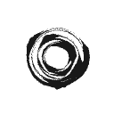

# 4Dwire

Research code for [*Optimizing 4D Wires for Sparse 3D Abstraction*](https://arxiv.org/abs/2605.11977). The main experiment optimizes one continuous 3D B-spline with variable width so that its three orthogonal views match different text prompts. `wire4d.py` also contains the separate multi-path DreamWire experiment retained from the source notebook. This repository is an organized version of the notebook in `archive/multive_wire_art.ipynb`.

## Contents

- `wire4d.py`: models, rendering, training functions, and command line interface.
- `run_prompt_examples.py`: run multiple B-spline prompt sets and save each result separately.
- `4Dwire.ipynb`: short notebook demo. It renders the bundled checkpoints, surface filling examples, and included results.
- `surface_filling.py`: ordered OBJ surface curve loading, silhouette optimization, optional CLIP guidance, and generated sphere/torus examples.
- `archive/3d_surface_filling_v6.ipynb`: original surface filling notebook for reference.
- `inputs/prompt.json`: named sets of three prompts, one for each orthogonal view.
- `inputs/points_final.pt` and `checkpoints/model_1200.pth`: small sample assets for the CPU demos.
- `examples/results/`: included preview images and run metadata. Generated checkpoints and images go to `outputs/`, which is ignored by Git.

## Requirements

The tested setup is Linux, Python 3.10, PyTorch 2.3.1, torchvision 0.18.1, CUDA runtime 12.1, a compatible NVIDIA driver and CUDA compiler, and a CUDA-enabled `pydiffvg` build. CPU rendering works, but Stable Diffusion training requires a CUDA GPU. The full training runs here were tested on an RTX 3090 with 24 GB VRAM. The pretrained Stable Diffusion weights are downloaded separately and are not included in this repository.

## Install

Create an environment and install the tested PyTorch build. The PyTorch command follows the [official previous-version instructions](https://docs.pytorch.org/get-started/previous-versions/):

```bash
conda create -n 4dwire python=3.10 pip cmake -y
conda activate 4dwire
conda install pytorch==2.3.1 torchvision==0.18.1 torchaudio==2.3.1 pytorch-cuda=12.1 -c pytorch -c nvidia
python -m pip install -r requirements.txt
```

Build `pydiffvg` in the same environment, following its [upstream build instructions](https://github.com/BachiLi/diffvg). Clone it outside this repository and fetch its submodules. `DIFFVG_CUDA=1` prevents an accidental CPU build when the build shell cannot see the GPU:

```bash
git clone --recursive https://github.com/BachiLi/diffvg.git "$HOME/diffvg-src"
cd "$HOME/diffvg-src"
DIFFVG_CUDA=1 python setup.py install
cd -
```

The CUDA compiler (`nvcc`) and CMake must be available when building `pydiffvg`. On the tested machine, PyTorch uses CUDA 12.1 and the CUDA compiler is 12.3. Check the installation before training:

```bash
python verify_install.py --require-cuda --surface
```

Run `python verify_install.py --require-cuda --load-guidance` to also download/load Stable Diffusion and encode three prompts. The original notebook uses the legacy model ID `runwayml/stable-diffusion-v1-5`, which may require cached files or access. Fresh installations default to the [public Stable Diffusion v1.5 mirror](https://huggingface.co/stable-diffusion-v1-5/stable-diffusion-v1-5). To use the exact cached legacy ID used for the included training results, set `FOURDWIRE_MODEL_ID=runwayml/stable-diffusion-v1-5` before running. The first model download is several gigabytes.

The existing `diffvg` conda environment on this machine passed CPU and CUDA rasterization, loading the cached legacy Stable Diffusion model, prompt encoding, and a clean-copy execution of the demo notebook. A fresh dependency download and `pydiffvg` rebuild were not run here; use `verify_install.py` after following the commands above. The existing shared environment has unrelated `pip check` conflicts (`httpcore`/`h11` and `opencv-python-headless`/NumPy), so use a new environment for a clean installation.

For Jupyter, register this environment and select its kernel:

```bash
python -m ipykernel install --user --name 4dwire --display-name "4Dwire"
jupyter lab 4Dwire.ipynb
```

## Quick demos

```bash
python wire4d.py demo-dreamwire --device cpu
python wire4d.py demo-bspline --device cpu
```

The commands write three-view images to `outputs/`. Use `--device cuda` for GPU rendering. The notebook runs both demos and displays the precomputed results from `examples/results/`; it can execute after cloning without the previous training outputs.

## Surface filling curves

`surface_filling.py` ports the surface curve workflow from `3d_surface_filling_v6.ipynb`. It reads an ordered `l` polyline and a corresponding triangular mesh from OBJ files, permutes OBJ axes to the notebook's Z-up convention, optimizes 3D wire positions and widths against five mesh silhouettes, and saves five views plus `curve.pt`. The generated sphere and torus examples need no external assets:

```bash
python surface_filling.py --example sphere --device cpu --steps 3 --size 128 --points 90 --output outputs/sphere
python surface_filling.py --example torus --device cpu --steps 3 --size 128 --points 90 --output outputs/torus
```

 

For a full geometry run, the v6 notebook uses **251 updates**. Use CUDA and your own ordered curve and mesh files:

```bash
python surface_filling.py --curve-obj /path/to/003.obj --mesh-obj /path/to/mesh.obj --device cuda --steps 251 --size 512 --points 1100 --output outputs/my_surface
```

The source notebook's `SF/curves/bob/003.obj` and `mesh.obj` are local inputs and are not bundled here. Its optional CLIPAG text or style guidance requires `python -m pip install -r requirements-surface-style.txt` and a separately supplied CLIPAG checkpoint. For example:

```bash
python surface_filling.py --example sphere --device cuda --steps 251 --target-prompt "infinity symbol" --clip-pretrained /path/to/CLIPAG_ViTB32.pt --output outputs/sphere_clip
```

Use `--style-source-image` and `--style-target-image` instead of `--target-prompt` for the image style direction. The CLI uses a resampled cubic wire and triangle rasterized silhouette so it runs independently of the notebook's global variables. It retains the v6 camera arrangement, width and visibility rules, multi resolution silhouette loss, and directional CLIP objective; outputs should not be treated as bitwise reproductions of that notebook.

## Train

The B-spline experiment in the original notebook sets `epoch_num = 1801`, so it performs 1,801 optimizer updates numbered 0–1800. Use a named prompt set from `inputs/prompt.json`:

```bash
python wire4d.py train-bspline --prompt-set food --steps 1801 --schedule-steps 1801
```

For a 1,000-update partial run that follows the first 1,000 updates of the notebook's noise schedule:

```bash
python wire4d.py train-bspline --prompt-set cat --steps 1000 --schedule-steps 1801
```

`--steps` controls the number of updates; `--schedule-steps` controls the denominator used for the SDS noise schedule. The B-spline implementation uses seed 365 by default, 210 keypoints, and the optimizer settings from the original notebook. Checkpoints and progress images are written to `outputs/`. The included `examples/results/1000/` previews are from three 1,000-update runs with seed 365 and the 1,801-step schedule. The three output views follow the order of prompts in the selected JSON list.

To run several prompt sets while keeping their results separate:

```bash
python run_prompt_examples.py cat food vehicles --steps 1000 --schedule-steps 1801
```

The older multi-path DreamWire workflow is available as `python wire4d.py train-dreamwire --steps 801`. It is a separate experiment from the single B-spline method.

## Citation

If you use this code or results, please cite [the paper](https://arxiv.org/abs/2605.11977). The same entry is in `CITATION.bib`.

```bibtex
@misc{wu2026optimizing4dwiressparse,
      title={Optimizing 4D Wires for Sparse 3D Abstraction},
      author={Dong-Yi Wu and Tong-Yee Lee},
      year={2026},
      eprint={2605.11977},
      archivePrefix={arXiv},
      primaryClass={cs.CV},
      url={https://arxiv.org/abs/2605.11977},
}
```
